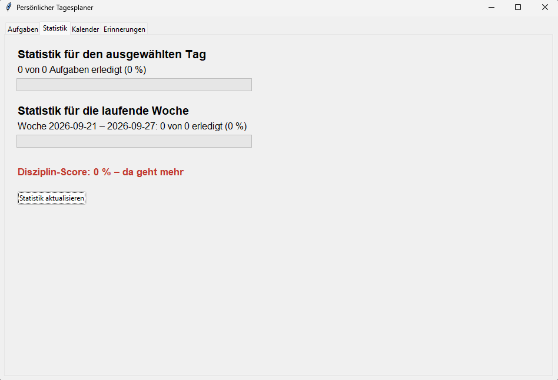
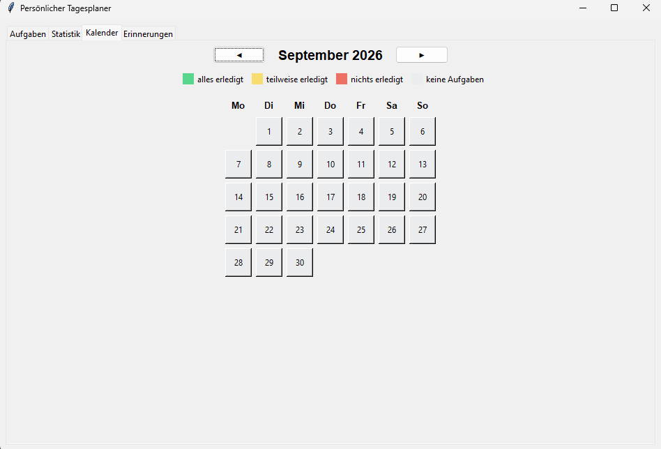
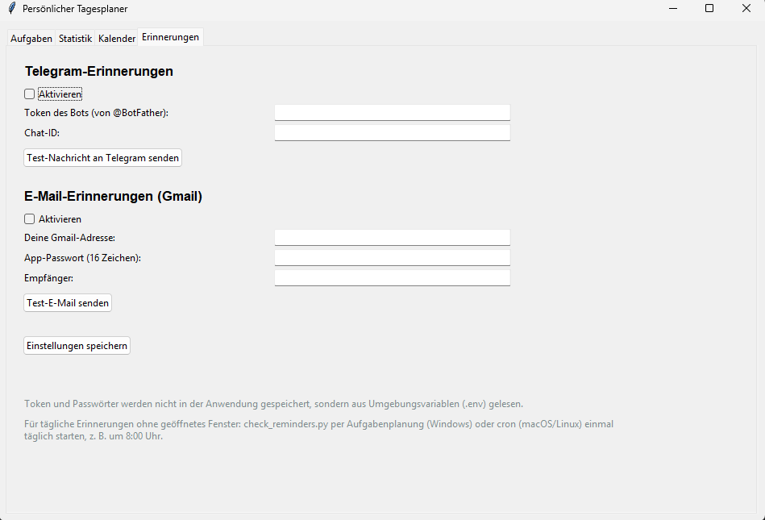

# 📅 Personal Day Planner

Eine Desktop-Anwendung zur persönlichen Tagesplanung, entwickelt mit **Python und Tkinter**.

Die Anwendung ermöglicht es, Aufgaben zu verwalten, Termine zu planen, Statistiken zu sehen und automatische Erinnerungen per Telegram oder E-Mail zu erhalten.

---

## 📝 Über das Projekt

Der **Personal Day Planner** ist eine selbst entwickelte Desktop-Anwendung für die tägliche Organisation.

Das Projekt wurde mit Python entwickelt und verwendet **Tkinter** für die grafische Benutzeroberfläche.

Das Ziel war es, eine einfache und übersichtliche Anwendung zu entwickeln, mit der man seine Aufgaben und Termine an einem Ort verwalten kann.

---

## ⚙️ Funktionen

- ✅ Aufgaben erstellen und verwalten
- ✏️ Aufgaben bearbeiten
- 🗑️ Aufgaben löschen
- 📅 Tages- und Monatsübersicht
- 📊 Statistiken über erledigte Aufgaben
- 🔔 Automatische Erinnerungen
- 📱 Erinnerungen über Telegram
- 📧 Erinnerungen per E-Mail
- 🌍 Mehrsprachige Benutzeroberfläche
- 🇩🇪 Deutsch
- 🇺🇦 Ukrainisch
- 💾 Speicherung und Verwaltung der Aufgaben
- 🧪 Automatisierte Tests

---

## 📊 Statistik

Die Anwendung zeigt Informationen über die erledigten Aufgaben.

Zum Beispiel können die erledigten und offenen Aufgaben übersichtlich ausgewertet werden.

---

## 📅 Kalender

Der integrierte Kalender ermöglicht eine Übersicht über Aufgaben und Termine an verschiedenen Tagen.

Dadurch kann man die Planung nicht nur für heute, sondern auch für andere Tage organisieren.

---

## 🔔 Automatische Erinnerungen

Der Planner kann automatisch an Aufgaben erinnern.

Unterstützte Benachrichtigungen:

- 📱 Telegram
- 📧 E-Mail

Für die Konfiguration werden Umgebungsvariablen verwendet.

Sensible Daten wie Bot-Tokens oder Passwörter werden **nicht** im Repository gespeichert.

---

## 📸 Screenshots

### Aufgabenübersicht


### Statistik


### Kalender


### Erinnerungen


---

## 🛠️ Verwendete Technologien

- **Python 3**
- **Tkinter**
- **python-dotenv**
- **Telegram Bot API**
- **Gmail / SMTP**
- **unittest**
- **Git & GitHub**

---

## 📁 Projektstruktur

```text
personal-day-planner/
│
├── main.py
├── task_manager.py
├── reminders.py
├── check_reminders.py
├── config.py
├── i18n.py
│
├── tests/
│
├── locales/
│
├── .env.example
├── .gitignore
├── requirements.txt
└── README.md
